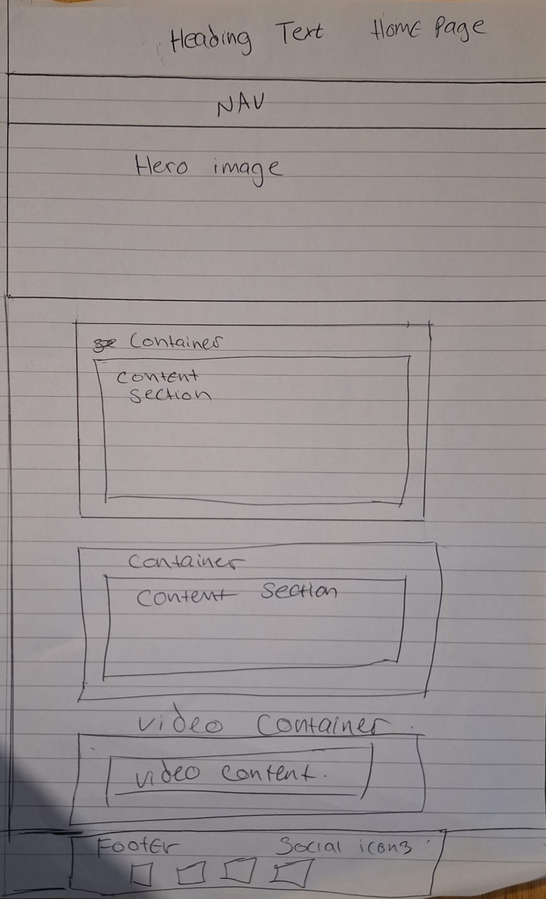
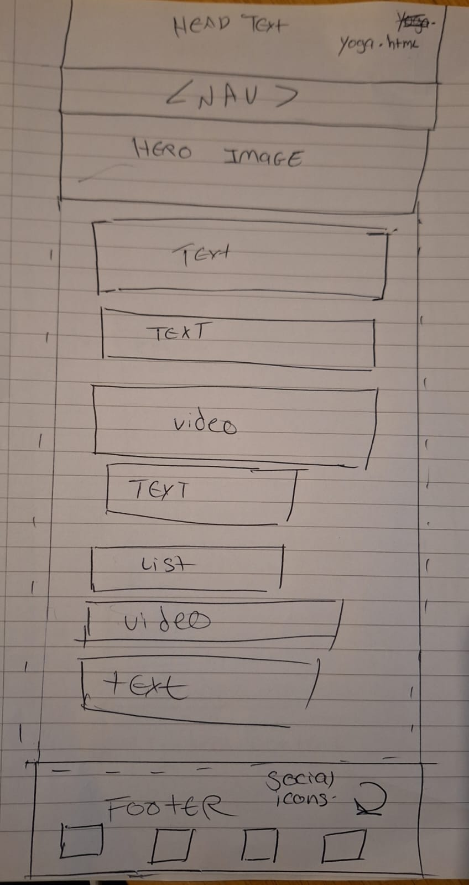
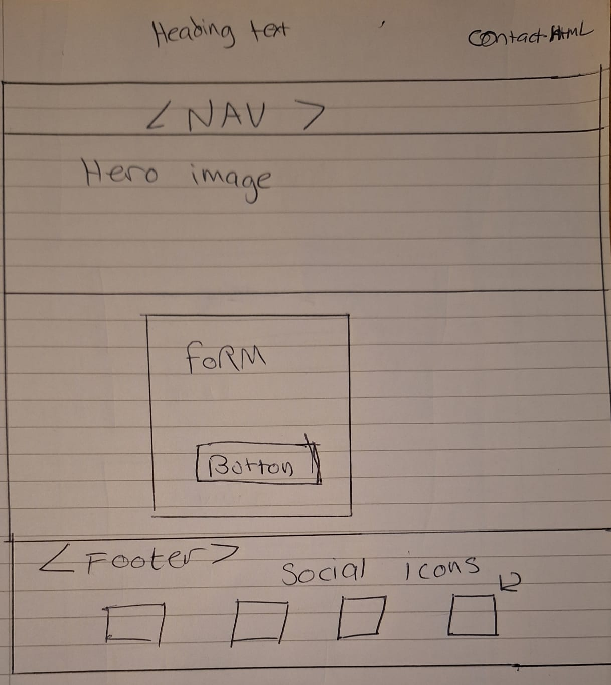

 # Kundalini Yoga

[Live Site](https://tootechnical.github.io/kundalini-yoga/index.html) <!-- Replace # with your live site link -->

## Brief Introduction

# Welcome to Kundalini Yoga

Welcome to Kundalini Yoga, a transformative journey of self-discovery and holistic well-being. Our website is dedicated to sharing the profound teachings and practices of Kundalini Yoga, an ancient spiritual tradition rooted in the wisdom of the East. Through a combination of physical postures, breathwork, meditation, and mantra chanting, Kundalini Yoga offers a path to awakening the dormant energy within and experiencing higher states of consciousness.

Whether you're new to yoga or a seasoned practitioner, our platform offers a diverse range of practices suitable for all levels. Dive into our curated collection of yoga sessions, meditation practices, and educational resources designed to nourish your mind, body, and spirit.

Embark on this sacred journey with us and explore the transformative power of Kundalini Yoga to cultivate vitality, balance, and inner harmony in your life. Join our vibrant community and awaken to the infinite potential that resides within you.

## Responsivity Example Image

 <!-- Add an example image showcasing responsivity -->

## Contents

- [UX (User Experience)](#ux-user-experience)
- [Design](#design)
- [Website Features](#website-features)
- [Tablet/Mobile View](#tabletmobile-view)
- [Future Features](#future-features)
- [Technologies Used](#technologies-used)
- [Deployment](#deployment)
- [Testing](#testing)
- [Credits](#credits)

# Kundalini Yoga

This is a comprehensive guide to creating a Kundalini Yoga website using HTML, CSS, and a touch of Font Awesome. The website includes three main pages: Home, Yoga, and Contact. The Home page introduces Kundalini Yoga, the Yoga page delves into the practice and its benefits, and the Contact page allows users to get in touch.

## UX (User Experience)

The user experience is designed to be intuitive and engaging. The website features a clean layout, easy-to-read typography, and a calming color scheme. Users can easily navigate between pages using the navigation bar, and the content is structured to provide a logical flow of information.

## User Stories

- As a user, I want to learn about Kundalini Yoga and its origins so that I can understand its history and significance.
- As a user, I want to explore the benefits of Kundalini Yoga and its practices so that I can decide if it's right for me.
- As a user, I want to contact the Kundalini Yoga organization so that I can ask questions, provide feedback, or get involved.

## Strategy

The goal of this project is to create an informative and engaging website about Kundalini Yoga. The website should appeal to users who are interested in yoga, meditation, and personal growth. The primary call-to-action is for users to learn about Kundalini Yoga and its benefits, with a secondary call-to-action to get in touch with the organization.

## Scope

The scope of this project includes:

- Designing and developing a responsive website using HTML, CSS, and Font Awesome
- Creating a clean and calming layout with easy-to-read typography and a soothing color scheme
- Providing information about Kundalini Yoga, its origins, benefits, and practices
- Allowing users to contact the Kundalini Yoga organization

## Structural

The website is structured as follows:

- Header: Contains the main heading and navigation bar
- Main: Contains the hero image and content sections
- Footer: Contains the social media icons and copyright information

## Wireframe for the Home Page

- 

  ## Wireframe for the Yoga page
  
- 

  ## Wireframe for the Contact Page

- 

  
  

## Surface

The surface of the website includes:

- Typography: Arial, sans-serif
- Colors: #f4f4f4 (background), #333 (text), #fff (social media icons)
- Imagery: A hero image of a yoga pose
- Design: Clean and calming layout with easy-to-read typography and a soothing color scheme

## Typography

The website uses Arial, sans-serif as the primary font. Headings are bold and larger than body text for emphasis.

## Colour Scheme

The color scheme is designed to be calming and soothing. The primary background color is #f4f4f4, with text in #333. Social media icons are in #fff.

## Imagery

The hero image is the OHM Symbol that represents Kundalini Yoga.

The image below represents someone meditating with the view of the chakras.

## Design

The design is clean and calming, with easy-to-read typography and a soothing color scheme. The layout is simple and intuitive, with a clear hierarchy of information. The navigation bar is easy to use, and the footer contains the social media icons and copyright information.

Overall, this Kundalini Yoga website is designed to be informative, engaging, and calming. Users can learn about Kundalini Yoga, its origins, benefits, and practices, and get in touch with the organization. The website is easy to navigate, with a clean and calming layout, easy-to-read typography, and a soothing color scheme.

Details about the design aspects of your project.

## Website Features
# Kundalini Yoga Website Features

The Kundalini Yoga website is designed to provide a seamless and engaging user experience, showcasing the essence of Kundalini Yoga through a modern and responsive design. Below is a comprehensive list of the key features implemented on the site.

## Design and Layout
- **Responsive Design:** Utilizes HTML, CSS, and Font Awesome to ensure a responsive and accessible experience across all devices.
- **Typography and Colors:**
  - **Primary Font:** Arial, sans-serif, with bold headings to draw attention.
  - **Color Scheme:** A calming and soothing palette featuring a primary background color of `#f4f4f4` and text color of `#333`.
- **Clean and Calming Layout:** The overall design focuses on easy-to-read typography and a soothing color scheme to enhance the user's experience.

## Navigation and Content
- **Navigation Bar:** A user-friendly navigation bar at the top of each page facilitates easy movement between different sections.
- **Hero Image:** Features a prominent yoga pose representing Kundalini Yoga, which visually communicates the focus of the website.
- **Information About Kundalini Yoga:** Detailed sections describe the origins, benefits, and practices of Kundalini Yoga, providing valuable insights to visitors.

## Interaction and Connectivity
- **Contact Form:** A dedicated form allows users to contact the Kundalini Yoga organization directly, facilitating engagement and communication.
- **Social Media Integration:**
  - **Icons in Footer:** Links to the organization's social media platforms are provided in the footer, encouraging users to connect on various platforms.
  - **Easy-to-Use Navigation Bar and Footer:** Includes all necessary links, social media icons, and copyright information, ensuring a comprehensive user interface.

The website's structure and features are designed to provide a simple, intuitive layout with a clear hierarchy of information, making it accessible and informative for all visitors.

## Tablet/Mobile View

## Future Features

# Future Features for Kundalini Yoga Website

As part of our ongoing effort to enhance the user experience and expand the offerings of the Kundalini Yoga website, we are considering several exciting new features. These additions aim to increase engagement, ease of use, and accessibility, ensuring that our users have a seamless and enriching experience.

## Planned Enhancements

### Online Booking System
- **Functionality:** Enable users to book yoga classes and workshops directly through the website, integrated with a dynamic class calendar.

### E-commerce Functionality
- **Purpose:** Sell Kundalini Yoga-related products such as clothing, mats, and props, expanding our service offerings directly from the website.

### Testimonials Section
- **Goal:** Display positive feedback from our community to build trust and credibility among new and existing users.

### Social Media Integration
- **Expansion:** Enhance connection with the organization’s social media accounts to boost visibility and user engagement.

### Mobile App Development
- **Development:** Create a dedicated mobile app to provide easy access to class schedules, booking options, and other resources.

### Multi-Language Support
- **Accessibility:** Offer the website in multiple languages to cater to a global audience, enhancing accessibility and inclusivity.

### Live Streaming
- **Service:** Provide live streaming of classes and workshops to accommodate users who cannot attend in person.

### Virtual Reality (VR) Integration
- **Innovation:** Implement VR technology to offer immersive experiences that allow users to explore Kundalini Yoga in a virtual environment.

### Gamification
- **Engagement:** Introduce gamification elements to motivate users to track their yoga practice progress and earn rewards.

### Personalized Recommendations
- **Technology:** Utilize machine learning algorithms to deliver personalized class, workshop, and product recommendations based on user preferences and behavior.

## Conclusion

These potential features are designed to enhance the functionality of the Kundalini Yoga website, making it a more comprehensive and user-friendly resource. By integrating these technologies and services, we aim to support our users' yoga journeys more effectively and foster a deeper connection with the Kundalini Yoga community.

## Technologies Used

In this project, I've utilized a range of languages, frameworks, libraries, and tools. Here's a breakdown of each:

- **HTML**: The Kundalini Yoga website is built using HTML5, which is a markup language used for creating web pages.
- **CSS**: Cascading Style Sheets (CSS) is used for styling the web pages, including layout, colors, and fonts.
- **Font Awesome**: Font Awesome is a library of icons used in the website, such as the social media icons in the footer.
- **GitHub**: GitHub is used for version control and collaboration, allowing multiple developers to work on the project simultaneously.
- **Google Fonts**: Google Fonts is used for importing custom fonts into the website, such as the Arial, sans-serif font used for the body text.
- **Chrome DevTools**: Chrome DevTools is a set of web developer tools built into the Google Chrome browser, used for debugging and testing the website.

## Deployment

## Deployment Guide for Kundalini Yoga Website on GitHub Pages

In this section, I'll share how I deployed my Kundalini Yoga website project using GitHub Pages. Follow these steps if you'd like to replicate the process for your own project:

1. **Creating a GitHub Repository**
   - Initially, I needed a place to host my project files. I created a repository on GitHub by clicking the "New repository" button on my dashboard, ensuring the repository name reflected my project.

2. **Preparing the Project**
   - My project's main entry point is the `index.html` file, which is located at the root of the project structure. I organized all related files (like CSS, and images) within the repository to keep things tidy.

3. **Pushing the Project to GitHub**
   - To get my project onto GitHub, I started by initializing a Git repository in my project directory with `git init`.
   - I added all my files to the staging area with `git add .` and committed them with `git commit -m "Initial commit"`.
   - I then linked my local repository to the remote GitHub repository using `git remote add origin [URL of your GitHub repository]` and pushed my changes with `git push -u origin master`.

4. **Enabling GitHub Pages**
   - On the GitHub site, in my repository's "Settings" tab, I scrolled down to the "GitHub Pages" section.
   - I selected the `master` branch as the source and saved my settings, which immediately made GitHub Pages active for my repository.

5. **Custom Domain Configuration (Optional)**
   - I wanted my project to have a professional look with a custom domain, so under the same "GitHub Pages" settings, I added my custom domain in the "Custom domain" section.

6. **Accessing the Website**
   - After setting everything up, my site was available at `(https://tootechnical.github.io/kundalini-yoga/index.html)<repository>`. 
7. **Updating the Site**
   - To keep my site up-to-date, I regularly push new changes to the `master` branch. Each push automatically updates the live website, ensuring visitors always see the latest content.

By following these steps, I successfully deployed the Kundalini Yoga website on GitHub Pages, making it accessible to users worldwide. GitHub Pages is an excellent tool for hosting static websites like mine.

## Testing

**Index HTML Page for desktop view

**Index HTML Page for Mobile view

**Yoga HTML for Mobile view

**Yoga HTML for Desktop view

**Contact HTML for mobile

**Contact HTML for desktop

##Validation Testing:

## Index Web Page Validation Check:
- 

- ## Yoga Web Page Validation Check:
- - 
 
  - ## Contact Form Validation Check:
  - - 

## Credits

https://www.blackbox.ai/

https://chat.openai.com/g/g-k3IqoCe1l-code-guru/c/67fc7512-2c9c-4750-a790-9b6f5db02a08
https://colab.research.google.com/github/lllyasviel/Fooocus/blob/main/fooocus_colab.ipynb
