 # Kundalini Yoga

[LiveSite](https://kundalini-yoga-app-29d88017307f.herokuapp.com/register/) <!-- Replace # with your live site link -->

## Brief Introduction

# Welcome to Kundalini Yoga

Welcome to Kundalini Yoga, a transformative journey of self-discovery and holistic well-being. Our website is dedicated to sharing the profound teachings and practices of Kundalini Yoga, an ancient spiritual tradition rooted in the wisdom of the East. Through a combination of physical postures, breathwork, meditation, and mantra chanting, Kundalini Yoga offers a path to awakening the dormant energy within and experiencing higher states of consciousness.

Whether you're new to yoga or a seasoned practitioner, our platform offers a diverse range of practices suitable for all levels. Dive into our curated collection of yoga sessions, meditation practices, and educational resources designed to nourish your mind, body, and spirit.

Embark on this sacred journey with us and explore the transformative power of Kundalini Yoga to cultivate vitality, balance, and inner harmony in your life. Join our vibrant community and awaken to the infinite potential that resides within you.

## Responsivity Example Image

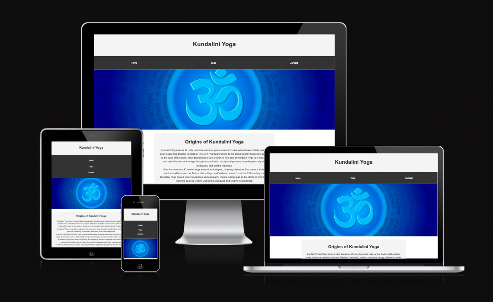 <!-- Add an example image showcasing responsivity -->

## Contents

- [UX (User Experience)](#ux-user-experience)
- [Design](#design)
- [Website Features](#website-features)
- [Tablet/Mobile View](#tabletmobile-view)
- [Future Features](#future-features)
- [Technologies Used](#technologies-used)
- [Deployment](#deployment)
- [Testing](#testing)
- [Credits](#credits)

# Kundalini Yoga

This is a comprehensive guide to creating a Kundalini Yoga website using HTML, CSS, and a touch of Font Awesome. The website includes three main pages: Home, Yoga, and Contact. The Home page introduces Kundalini Yoga, the Yoga page delves into the practice and its benefits, and the Contact page allows users to get in touch.

## UX (User Experience)

The user experience is designed to be intuitive and engaging. The website features a clean layout, easy-to-read typography, and a calming color scheme. Users can easily navigate between pages using the navigation bar, and the content is structured to provide a logical flow of information.

## User Stories

- As a user, I want to learn about Kundalini Yoga and its origins so that I can understand its history and significance.
- As a user, I want to explore the benefits of Kundalini Yoga and its practices so that I can decide if it's right for me.
- As a user, I want to contact the Kundalini Yoga organization so that I can ask questions, provide feedback, or get involved.

## Strategy

The goal of this project is to create an informative and engaging website about Kundalini Yoga. The website should appeal to users who are interested in yoga, meditation, and personal growth. The primary call-to-action is for users to learn about Kundalini Yoga and its benefits, with a secondary call-to-action to get in touch with the organization.

## Scope

The scope of this project includes:

- Designing and developing a responsive website using HTML, CSS, and Font Awesome
- Creating a clean and calming layout with easy-to-read typography and a soothing color scheme
- Providing information about Kundalini Yoga, its origins, benefits, and practices
- Allowing users to contact the Kundalini Yoga organization

### Structure
The website has a simple structure for ease of navigation:
- **Header**: Contains navigation links.
- **Main**: Features a hero image and sections for content.
- **Footer**: Includes social media links and copyright information.

### Wireframes
- [Home Page Wireframe](assets/images/indexwf.jpeg)
- [Yoga Page Wireframe](assets/images/yogawf.jpeg)
- [Contact Page Wireframe](assets/images/contactwf.jpeg)

  
  

## Surface

The surface of the website includes:

- Typography: Arial, sans-serif
- Colors: #f4f4f4 (background), #333 (text), #fff (social media icons)
- Imagery: A hero image of a yoga pose
- Design: Clean and calming layout with easy-to-read typography and a soothing color scheme

## Typography

The website uses Arial, sans-serif as the primary font. Headings are bold and larger than body text for emphasis.

## Colour Scheme

The color scheme is designed to be calming and soothing. The primary background color is #f4f4f4, with text in #333. Social media icons are in #fff.

## Imagery

The hero image is the OHM Symbol that represents Kundalini Yoga.

The image below represents someone meditating with the view of the chakras.

## Design

### Typography
The website uses Arial, sans-serif for a clean, readable appearance.

### Colour Scheme
The color scheme includes:
- Background: #f4f4f4
- Text: #333
- Social Media Icons: #fff

### Imagery
- Hero Image: OHM Symbol, representing Kundalini Yoga.
- Meditation Image: Depicts someone meditating with a view of the chakras.
  

## Features

### Current Features
- **Responsive Design:** Ensures the site is functional on all devices.
- **Navigational Components:** Easy-to-use header and footer for site navigation.
- **Social Media Integration:** Links to social platforms for enhanced connectivity.

### Future Enhancements
- **Online Booking System:** For easier scheduling of classes.
- **E-commerce Functionality:** To sell yoga-related products.
- **Multi-Language Support:** To cater to a global audience.

## Technologies Used
- **HTML5** and **CSS3**: For structuring and styling the website.
- **Font Awesome**: For icons.
- **GitHub**: For hosting and version control.
- **Google Fonts**: For custom fonts.
- **Chrome DevTools**: For debugging and testing.

## Deployment

### Steps to Deploy on GitHub Pages
1. **Create a GitHub Repository**.
2. **Prepare the project**: Ensure all files including `index.html` are in the root directory.
3. **Push to GitHub**: Use Git commands to push your project.
4. **Enable GitHub Pages** through the repository settings.
5. **Custom Domain (Optional)**: Configure if desired.

More details on these steps are available in the GitHub documentation.

## Testing

**Index HTML Page for desktop view

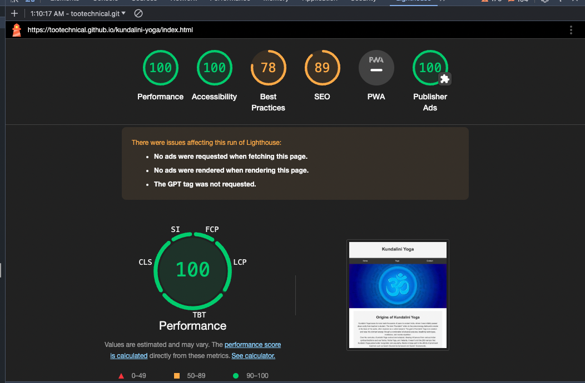

**Index HTML Page for Mobile view
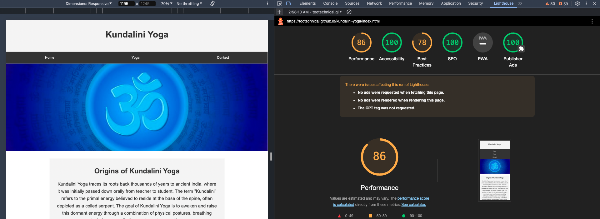

**Yoga HTML for Mobile view
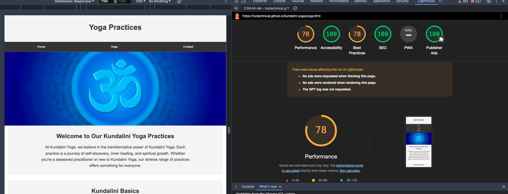

**Yoga HTML for Desktop view
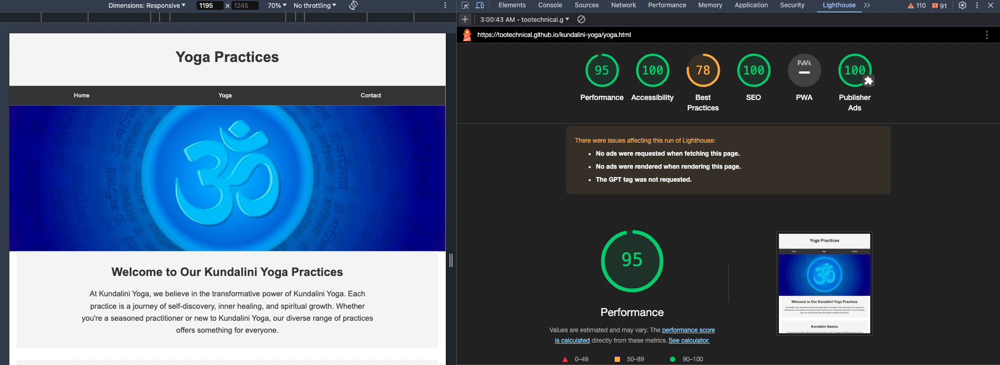

**Contact HTML for mobile
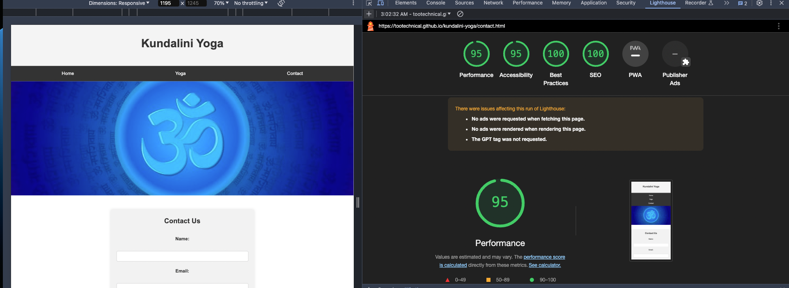

**Contact HTML for desktop
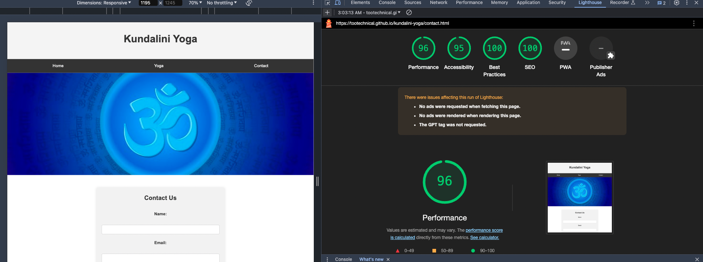

##Validation Testing:

## Index Web Page Validation Check:
- 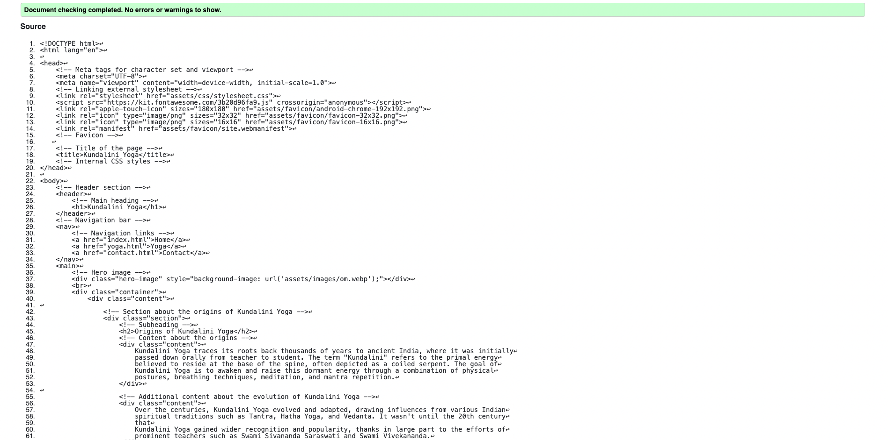

- ## Yoga Web Page Validation Check:
- - 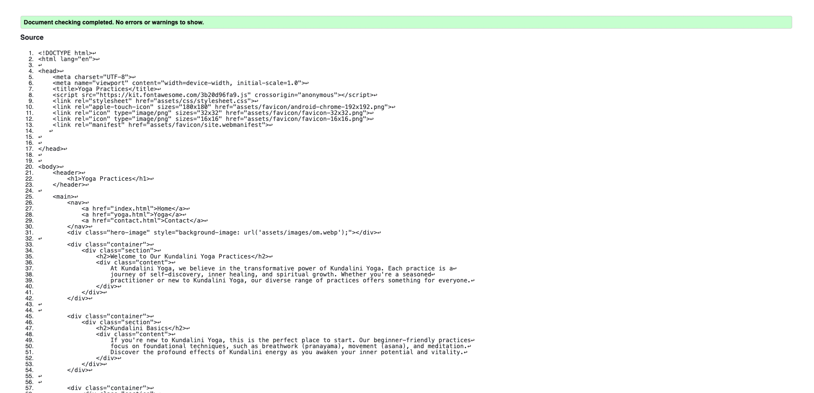
 
  - ## Contact Form Validation Check:
  - - 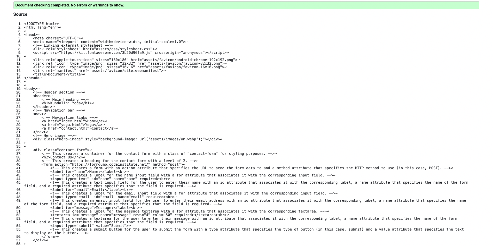
   
    - - ## Contact Form Validation Check:
  - - 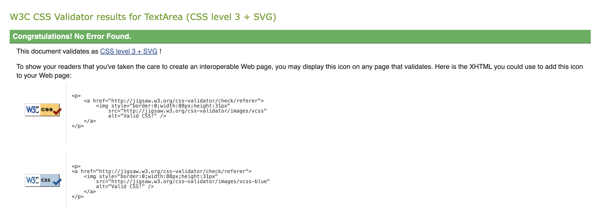

## Credits

- [Black Box AI](https://www.blackbox.ai/)
- [OpenAI Code Examples](https://chat.openai.com/)
- [Fooocus Project on Colab](https://colab.research.google.com/github/lllyasviel/Fooocus/blob/main/fooocus_colab.ipynb)
- [How to write good commit messages](https://cbea.ms/git-commit/#separate)
- [W3Schools HTML and CSS Tutorials](https://www.w3schools.com/html/)

